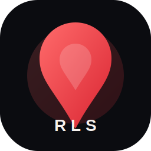

# Rory Semeah

**AI Technical Product Manager · RedLantern Studios**

Executive level proof layer. Easy to scan. Easy to trust. Built to show value at face value. 🧭

  <a href="./index.html">Live page</a> ·
  <a href="./CASE_STUDIES.md">Case studies</a> ·
  <a href="./IP_BOUNDARY.md">IP boundary</a>

## At a glance

| Area | Status |
| --- | --- |
| Role | AI Technical Product Manager |
| Studio | RedLantern Studios |
| Mode | Public proof, private moat |
| Geography | San Diego, CA |

## KPI board

| KPI | Meaning |
| --- | --- |
| 60 country rollout | Enterprise scale delivery across SAP and billing systems |
| 20 plus countries | OpenAI powered automation shipped into live operations |
| 4 live products | Studio, companion, learning, and career proof surfaces |
| 0 unnecessary noise | Clean communication and simple presentation |

## What I do

I turn messy work into clear product systems.
I work across enterprise delivery, AI enabled workflows, and public facing proof that helps people understand the value fast.

## Selected proof

### By Red OS
Multi tenant operations platform built on Next.js, Supabase, Vercel, and Anthropic API.

### Amina
AI companion and productivity product with web and iOS delivery.

### SwarmClaw
Operational AI system for orchestration, routing, and multi agent execution.

### Claudex Bridge
Cross engine session state and handoff layer for studio work.

### HireWire
AI career platform for matching, resume intelligence, and routing.

### Authentic Hadith
iOS app delivered through TestFlight QA and App Store approval.

## Education

- University of Phoenix, Bachelor of Science in Business Management
- University of Phoenix, Master of Science in Information Systems

## Certifications

- SAFe Scaled Agile Framework
- Certified Scrum Master
- CPMAI in progress

## IP boundary

Public means public.

This repo can show:
- outcomes
- screenshots
- summaries
- lessons
- redacted case studies

This repo cannot show:
- proprietary code
- private prompts
- secrets
- exact workflow logic
- internal credentials

## Contact

- Website: [rorysemeah.com](https://rorysemeah.com)
- LinkedIn: [linkedin.com/in/rory-semeah-30874555](https://linkedin.com/in/rory-semeah-30874555)
- GitHub: [redlanternstudios](https://github.com/redlanternstudios)

<strong>RedLantern Studios</strong> · simple on the surface, disciplined underneath
