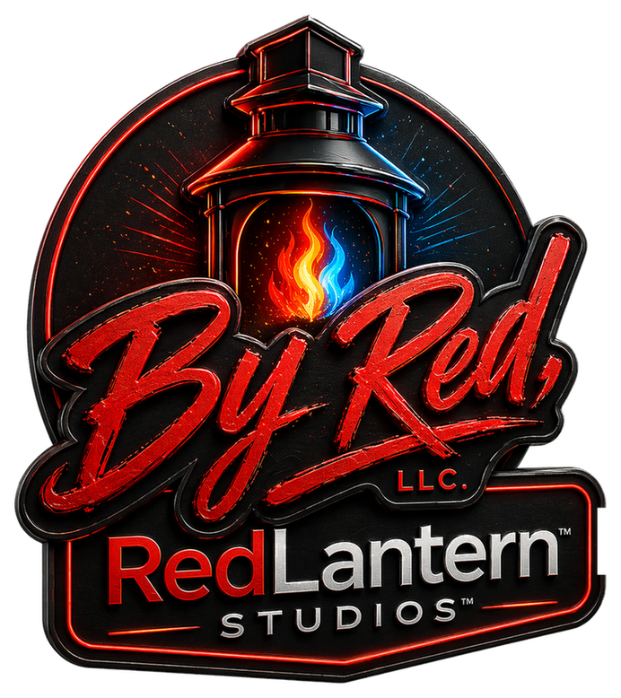

# Rory Semeah

**AI Technical Product Manager · RedLantern Studios**

Executive proof layer. Fast to read. Easy to trust. Built like a clean dashboard. 🧭

  <a href="./index.html">Live page</a> ·
  <a href="./CASE_STUDIES.md">Case studies</a> ·
  <a href="./IP_BOUNDARY.md">IP boundary</a>

  
  
  
  
  

## Snapshot

| Area | Status | Signal |
| --- | --- | --- |
| Role | AI Technical Product Manager | 🟢 Clear ownership |
| Studio | RedLantern Studios | 🔥 Brand anchored |
| Geography | San Diego, CA | 🌴 Based in market |
| Mode | Public proof, private moat | 🔒 IP protected |

## KPI board

| KPI | What it says |
| --- | --- |
| 60 country rollout | Enterprise scale delivery across SAP and billing systems |
| 20 plus countries | OpenAI powered automation shipped into live operations |
| 1000 plus tickets cleared | Support workflow redesign that got real work unstuck |
| 4 live products | Studio, companion, learning, and career proof surfaces |

### Delivery signal

| Area | Signal |
| --- | --- |
| Enterprise rollout | 60 country launch across SAP and billing systems |
| AI automation | 20 plus countries reached with OpenAI workflows |
| Support recovery | 1000 plus tickets cleared by workflow redesign |
| Public proof | 4 live products with a private moat |

## Story

I build enterprise systems, AI enabled products, and workflow automation that ship in the real world.
The thread through all of it is the same: clarify the problem, protect the moat, ship with receipts.

## Resume spine

### Enterprise and AI delivery
- Led a 60 country invoice platform rollout across SAP S 4HANA, SAP BRIM, Salesforce, and adjacent billing systems
- Deployed OpenAI powered workflow automation across 20 plus countries
- Partnered with engineering on AWS, Kubernetes, Terraform, REST APIs, GraphQL, CI CD, GitHub Actions, and Jenkins
- Used SQL and Looker to watch KPI movement and surface workflow friction early

### Products
- ByRedLanternOS, multi tenant operations platform built on Next.js, Supabase, Vercel, and Anthropic API
- Amina, AI companion and productivity product across web and iOS
- SwarmClaw, the RedLantern Build Team and QuietBuild OS layer for orchestration, routing, and handoff
- HireWire, AI career product with matching, resume intelligence, and confidence based routing
- Authentic Hadith, iOS app shipped through TestFlight QA and App Store approval

### Operating style
- Translate business goals into clear user stories and acceptance criteria
- Turn multi step work into simple operator flows
- Keep communication plain, direct, and useful
- Keep IP boundaries tight

## QuietBuild OS

SwarmClaw is the RedLantern Build Team. It runs the quiet operator layer behind the studio, keeping routing, receipts, and handoff clean while the actual work moves forward.

### Agent roster

| Agent | Role | Style |
| --- | --- | --- |
| SwarmClaw | Build lead | Routes work to the right lane and keeps the whole team aligned |
| Claudex Bridge | State keeper | Keeps receipts, context, and handoff synced |
| Robby PA | Intake desk | Filters repeat asks and sends work to the right place |
| Obsidian | Memory vault | Stores decisions, context, and truth |

## Selected proof

<table>
  <tr>
    <td><strong>🔥 RedLantern Studios</strong> Studio operating layer, branded workflows, and product coordination.</td>
    <td><strong>🧠 Amina</strong> Faith centered AI product with web and iOS surfaces, release discipline, and public proof artifacts.</td>
  </tr>
  <tr>
    <td><strong>📿 Authentic Hadith</strong> Production learning platform with web and mobile delivery, QA evidence, and release readiness work.</td>
    <td><strong>💼 HireWire</strong> AI career platform focused on matching, resume intelligence, and confidence based routing.</td>
  </tr>
</table>

## Brand board

  
  
  
  
  
  
  
  
  

## Education

- University of Phoenix, Bachelor of Science in Business Management
- University of Phoenix, Master of Science in Information Systems

## Certifications

- SAFe Scaled Agile Framework
- Certified Scrum Master
- CPMAI in progress

## IP boundary

Public means public.

This repo can show:
- outcomes
- screenshots
- summaries
- lessons
- redacted case studies

This repo cannot show:
- proprietary code
- private prompts
- secrets
- exact workflow logic
- internal credentials

## Contact

- Website: [rorysemeah.com](https://rorysemeah.com)
- LinkedIn: [linkedin.com/in/rory-semeah-30874555](https://linkedin.com/in/rory-semeah-30874555)
- GitHub: [redlanternstudios](https://github.com/redlanternstudios)

<strong>RedLantern Studios</strong> · simple on the surface, disciplined underneath

